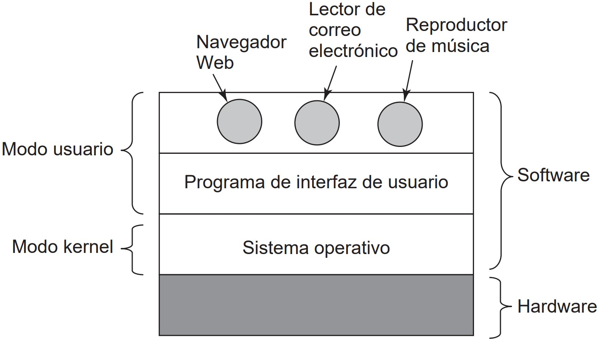
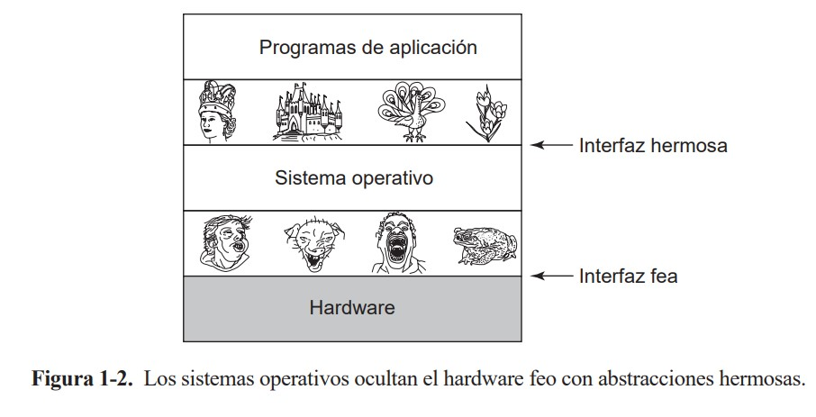

# QUE ES UN SISTEMA OPERATIVO?

## El sistema operativo como una máquina extendida

#### Figura 1-1. Ubiacion del sistema operativo

 

[ver Figura 1-1](#figura-1-1-ubiacion-del-sistema-operativo)

## El sistema operativo como administrador de recursos

#### Figura 1-2. Los sistemas operativos ocultan el hardware feo con abstracciones hermosas

 

[ver Figura 1-2](#figura-1-2-los-sistemas-operativos-ocultan-el-hardware-feo-con-abstracciones-hermosas)
